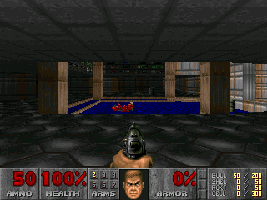
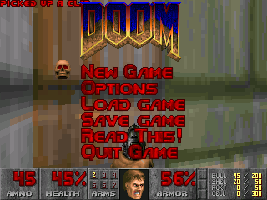

# Doom-Melting-Transition
 Python implimentation of the transition from Doom.

## Usage
Put background image in folder with name `background.png` and foreground image in folder with name `foreground.png`. Execute the python file and the output will be saved to `out.gif`.
Images must have same resolution. Both images must also have the same color mode (eg. RGB). Other file formats can be used (although I haven't added handling for them yet).
For best results, use original Doom resolution (320 x 200), otherwise change parameters in `melting.py` to better fit other resolutions.

## Example
### Background

### Foreground

### Output

